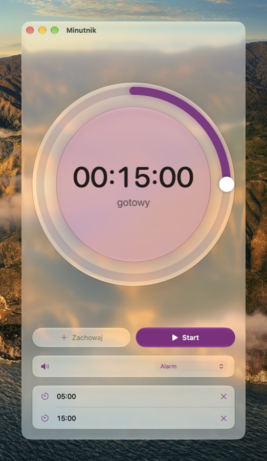
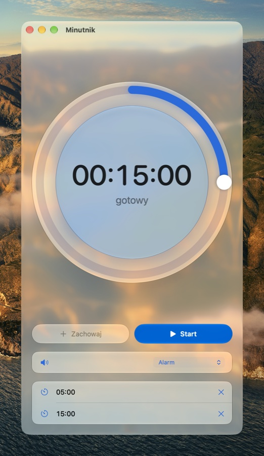
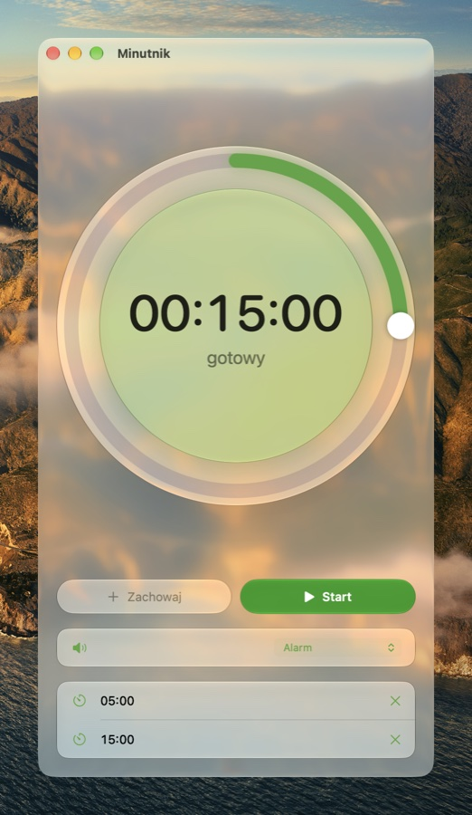
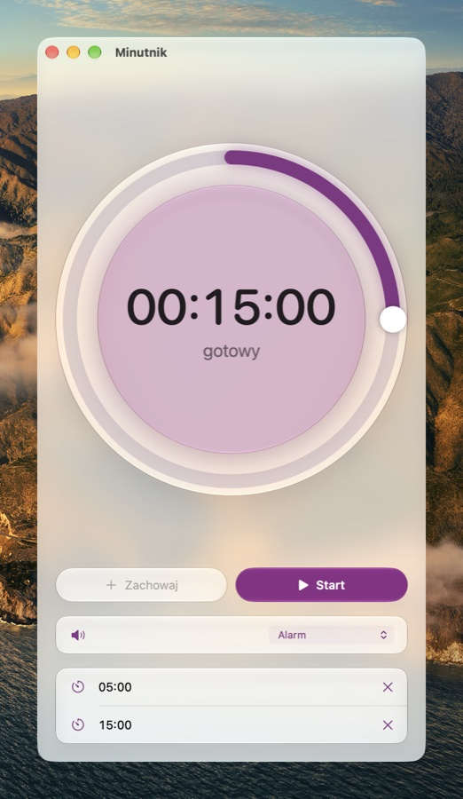
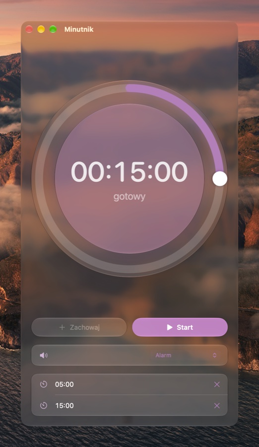
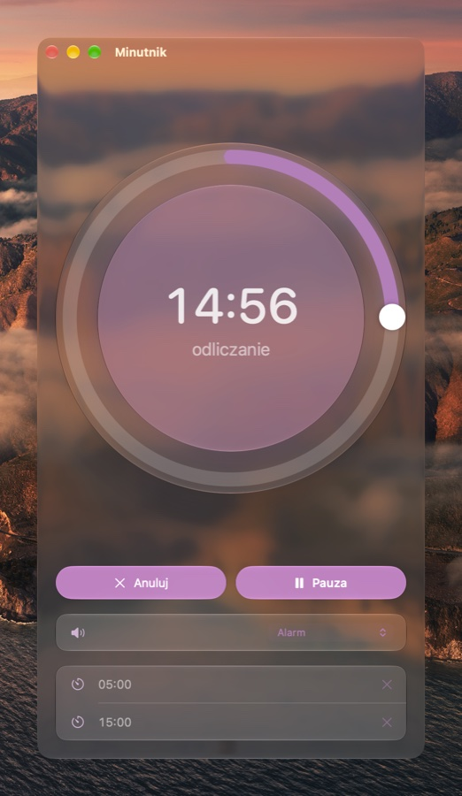
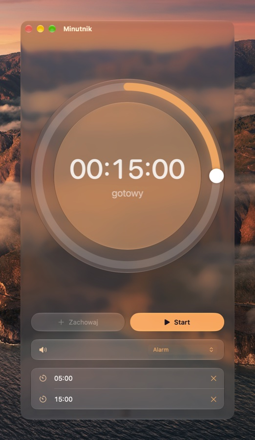
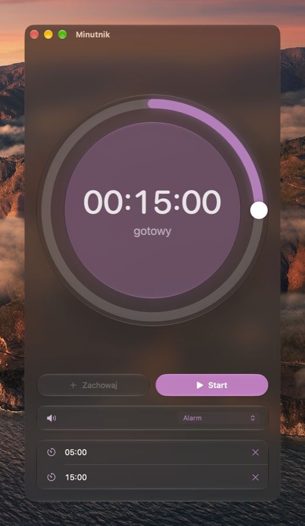
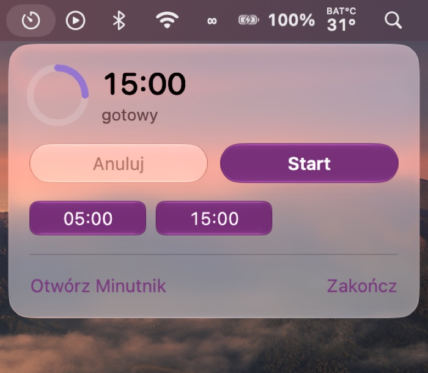
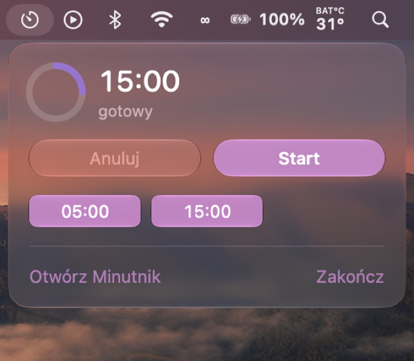

# Timer

*[Po polsku niżej.](#po-polsku)*

A timer for macOS: a big countdown dial, an alarm from the system's ringtones,
saved times, and the time in the menu bar. One window, and none of the settings
the system already gives you.

In Finder, the Dock and the menu bar it is named like the timer in the macOS
Clock app, in the system's language: "Timer", "Minutnik", "Minuteur"… The
bundle sits on disk as `Timer.app`, the way Clock sits as `Clock.app`.

<p align="center">
  
  
  
  
  
</p>
<p align="center">
  
  
  
  
</p>

Light and dark follow System Settings → Appearance, the color follows the
accent, and the glass follows the Liquid Glass slider.

The menu bar panel, opened from the timer icon:

<p align="center">
  
  
</p>

## Install

1. Download [Timer.zip](https://github.com/EnderNoch/Timer/raw/main/Timer.zip)
   and unzip it (double-click).
2. Drag `Timer.app` into Applications. Finder and the Dock show it under its
   name in your system's language.
3. First launch: the app is signed ad hoc, not by Apple, so macOS blocks it.
   Open System Settings → Privacy & Security, scroll down, click "Open Anyway"
   next to Timer and confirm. After that it opens normally — also on its own
   at login.

Requires macOS 26 or later on a Mac with Apple silicon.

## Everything from the system

The app has no switches for what the system already provides:

- **language** — the system's language (or this app's language from System
  Settings → General → Language & Region), 43 interface languages;
- **light / dark appearance, font** — as set in System Settings → Appearance,
  the system font;
- **color** — the accent from System Settings → Appearance → Color; a change
  arrives at once (KVO on `AppleAccentColor` and
  `NSColor.systemColorsDidChangeNotification`). Multicolor keeps the timer's
  violet;
- **glass** — the system's Liquid Glass, so it follows the slider in Settings;
- **icons** — SF Symbols; the app icon is a Liquid Glass icon from Icon
  Composer that follows the icon style (default, dark, clear, tinted);
- **name** — the word "Timer" from the Clock app's localization tables
  (`Localizable.loctable`, key `TIMER`), written into `*.lproj/InfoPlist.strings`
  at build time.

## Layout

At the top, a dial that grows with the window: a glass disc, a tinted lens
with the time in the middle, and the arc is the time left on a kitchen
timer's face — one full turn is an hour — with a knob at its end. While idle,
turning the knob adds or takes away minutes from the set time (typed hours and
seconds stay), and clicking the time lets you type it into a `00:00:00` field
with fixed colons: digits only, coming in from the right like on a microwave
(1, 5, 0, 0 is 00:15:00), Backspace takes one back, Return finishes.

Under the dial, two buttons with icons: Save (adds the time to the presets)
and Start while idle, Cancel (Esc) and Pause / Resume / Stop while it runs.
Below, glass sections with an icon leading each row: the sound (a list of the
system's ringtones at the right edge — picking one plays it for as long as the
Apex ringtone, 4.4 s) and the presets (a click loads one, the cross deletes).

The window has bounds like System Settings — from 420×750 to 560×1100, no full
screen. Closing the window doesn't quit the timer: it keeps counting in the
menu bar, and a click on the Dock icon brings the window back.

## What it does

- countdown, pause, cancel, counting on over time (in red)
- the alarm from the system's ringtones — the same ones the Clock app has
  (`ToneLibrary.framework/…/Ringtones`), named in the system's language from
  the `TL.loctable` tables; Radar by default, like the timer in Clock on iPhone
- presets
- opens at login — switched on by itself at the first launch (`SMAppService`);
  switched off in System Settings → General → Login Items, with no switch in
  the app
- menu bar: the time while counting down; a click opens a panel like Control
  Center — the time with a small ring, the buttons, presets to start with one
  click, mute over time, "Open Timer" and Quit

Words macOS has for itself come from its own localization tables: Start,
Pause, Resume, Cancel and Sound from the Clock app, Delete and Save from
AppKit, ringtone names from the system's tone library.

## Built with

| Layer | Technology |
| --- | --- |
| App | Swift + SwiftUI: `Window` and `MenuBarExtra`, state in `@Observable` |
| Glass | `NSGlassEffectView` for the whole window, `.glassEffect` on the dial and sections, `.glass` / `.glassProminent` buttons |
| Sound | `NSSound` — the system's ringtones from `ToneLibrary.framework`, the same as in Clock |
| Settings | `UserDefaults` (time, presets, ringtone) |
| Icon | `Timer.icon` from Icon Composer — the system does the glass and icon styles |
| Build | `build.sh` — `swiftc`, `actool`, `Info.plist`, `codesign --sign -` (ad hoc) |

No Xcode project and no dependencies — `swiftc` and `actool` (from Xcode, for
the icon).

## Files

```
Sources/TimerApp.swift   the app: window, menu bar, Dock
Sources/Model.swift      timer state, sound, saving, the system accent
Sources/Views.swift      dial, buttons, time entry, sections, window glass
Sources/Strings.swift    text in 43 languages
Timer.icon               the icon from Icon Composer (SVG layers + icon.json)
build.sh                 build, Timer.zip, install into /Applications
screenshots/             screenshots for this README
```

## Build from source

```sh
./build.sh
```

The script compiles, puts together `Timer.app`, signs it ad hoc, packs it into
`Timer.zip` and installs it into `/Applications`.

## License

All rights reserved — see [LICENSE](LICENSE). You may download the finished
app and use it on your own computer. This is not open source: copying the
code, distributing it other than by a link to this repository, modifying it
and training AI models on it require the author's written permission.

Made by [EnderNoch](https://github.com/EnderNoch) (Atypical Maker) · part of
[Atypical Maker Mac Apps](https://github.com/EnderNoch/Atypical-Maker-Mac-Apps).

---

## Po polsku

Timer na macOS: duża tarcza odliczająca, alarm z własnym dźwiękiem, zapisane
czasy i czas w pasku menu. Jedno okno i żadnych ustawień, które daje system.

W Finderze, Docku i menu nazywa się jak timer w Zegarze macOS, w języku
systemu: „Minutnik”, „Timer”, „Minuteur”… Pakiet leży na dysku jako
`Timer.app`, tak jak Zegar leży jako `Clock.app`.

Jasny i ciemny wygląd idą za Ustawieniami → Wygląd, kolor za akcentem, a szkło
za suwakiem Liquid Glass.

Panel z paska menu, otwierany ikoną minutnika:

<p align="center">
  
  
</p>

### W czym to jest zrobione

| Warstwa | Technologia |
| --- | --- |
| Aplikacja | Swift + SwiftUI: `Window` i `MenuBarExtra`, stan w `@Observable` |
| Szkło | `NSGlassEffectView` na całe okno, `.glassEffect` na tarczy i sekcjach, przyciski `.glass` / `.glassProminent` |
| Dźwięk | `NSSound` — dzwonki systemu z `ToneLibrary.framework`, te same co w Zegarze |
| Pamięć ustawień | `UserDefaults` (czas, presety, dzwonek) |
| Ikona | `Timer.icon` z Icon Composera — szkło i style ikon (ciemny, przejrzysty, matowy) robi system |
| Budowanie | `build.sh` — `swiftc`, `actool`, `Info.plist`, `codesign --sign -` (ad-hoc) |

Bez projektu Xcode i bez zależności — `swiftc` i `actool` (ten z Xcode, do
ikony). Wymaga macOS 26.

### Wszystko z systemu

Aplikacja nie ma przełączników, które system już daje:

- **język** — język systemu (albo język tej aplikacji z Ustawień → Ogólne →
  Język i region), 43 języki interfejsu;
- **jasny / ciemny wygląd, czcionka** — jak w Ustawieniach → Wygląd, czcionka
  systemu;
- **kolor** — akcent z Ustawień → Wygląd → Kolor; zmiana dochodzi od razu
  (KVO na `AppleAccentColor` i `NSColor.systemColorsDidChangeNotification`).
  Przy „wielokolorowym” zostaje fiolet timera;
- **szkło** — systemowe Liquid Glass, więc idzie za suwakiem w Ustawieniach;
- **ikony** — SF Symbols;
- **nazwa** — słowo „Timer” z tabel tłumaczeń Zegara macOS
  (`Localizable.loctable`, klucz `TIMER`), wpisywane przy budowaniu do
  `*.lproj/InfoPlist.strings`.

### Układ

Jak Światło ekranu. Na górze tarcza, która rośnie z wysokością okna: szklany
krążek, w środku przyciemniona soczewka z czasem, a łuk to czas na tarczy
minutnika kuchennego — pełny obrót to godzina — z gałką na końcu. W spoczynku
obrót gałki dodaje albo odejmuje minuty od ustawionego czasu (wpisane godziny
i sekundy zostają), a w liczbę da się kliknąć i wpisać czas
w pole `00:00:00` ze stałymi dwukropkami: same cyfry, wpadające od prawej
jak w mikrofalówce (1, 5, 0, 0 to 00:15:00), Backspace cofa, Return kończy.

Pod tarczą dwa przyciski z ikonami: w spoczynku Zachowaj (dopisuje czas do
presetów) i Start, w trakcie Anuluj i Pauza / Wznów / Zatrzymaj. Niżej
szklane sekcje z ikoną na początku wiersza: dźwięk (lista dzwonków systemu
przy prawej krawędzi — wybrany gra najwyżej tyle, ile dzwonek Apeks, 4,4 s) i presety (klik wczytuje,
krzyżyk usuwa).

Okno ma granice jak Ustawienia: od 420×750 do 560×1100 i bez pełnego
ekranu. Zamknięcie okna nie zamyka timera: odlicza dalej w pasku menu,
a kliknięcie ikony w Docku przywraca okno.

### Co potrafi

- odliczanie, pauza, anulowanie, liczenie po czasie („po czasie”, na czerwono)
- alarm z dzwonków systemu — tych samych, które ma Zegar
  (`ToneLibrary.framework/…/Ringtones`), z nazwami w języku systemu z tabel
  `TL.loctable`; domyślnie Radar, jak minutnik w Zegarze na iPhonie
- presety czasów
- otwieranie przy logowaniu — włącza się samo przy pierwszym uruchomieniu
  (`SMAppService`); wyłącza się w Ustawieniach → Ogólne → Rzeczy otwierane
  podczas logowania, bez przełącznika w aplikacji
- pasek menu: czas w trakcie odliczania, a po kliknięciu panel jak Centrum
  sterowania — czas z małym pierścieniem, przyciski, presety do startu jednym
  kliknięciem, wyciszenie po czasie, „Otwórz Minutnik” i Zakończ

Słowa, które macOS ma u siebie, są wzięte z jego tabel tłumaczeń: Start,
Pauza, Wznów, Anuluj i Dźwięk z Zegara, Usuń i Zachowaj z AppKit, nazwy
dzwonków z biblioteki dźwięków systemu.

### Pliki

```
Sources/TimerApp.swift   aplikacja: okno, pasek menu, Dock
Sources/Model.swift      stan timera, dźwięk, zapis, akcent systemu
Sources/Views.swift      tarcza, przyciski, pola czasu, sekcje, szkło okna
Sources/Strings.swift    teksty w 43 językach
Timer.icon               ikona z Icon Composera (warstwy SVG + icon.json)
build.sh                 budowanie, Timer.zip i instalacja w /Applications
screenshots/             zrzuty ekranu do README
```

### Instalacja

1. Pobierz [Timer.zip](https://github.com/EnderNoch/Timer/raw/main/Timer.zip)
   i rozpakuj go (dwuklik).
2. Przeciągnij `Timer.app` do folderu Aplikacje. W Finderze i Docku pokaże się
   jako „Minutnik” (albo „Timer” — w języku systemu).
3. Pierwsze uruchomienie: aplikacja jest podpisana ad-hoc, nie przez Apple,
   więc macOS ją zablokuje. Otwórz Ustawienia → Prywatność i ochrona,
   przewiń w dół i kliknij „Otwórz mimo to” przy Minutniku, potem potwierdź.
   Później otwiera się już normalnie — także sama przy logowaniu.

Wymaga macOS 26 lub nowszego i Maca z procesorem Apple.

### Budowanie ze źródeł

```sh
./build.sh
```

Skrypt kompiluje, składa pakiet `Timer.app`, podpisuje go ad-hoc, pakuje
do `Timer.zip` i instaluje w `/Applications`.

### Licencja

Wszelkie prawa zastrzeżone — patrz [LICENSE](LICENSE). Gotową aplikację wolno
pobrać i używać na własnym komputerze. To nie jest oprogramowanie otwarte:
kopiowanie kodu, rozpowszechnianie inaczej niż linkiem do tego repozytorium,
zmiany i trenowanie na nim modeli AI wymagają pisemnej zgody autora.

Autor: [EnderNoch](https://github.com/EnderNoch) (Atypical Maker).
